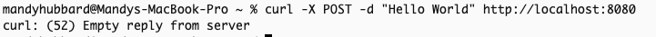
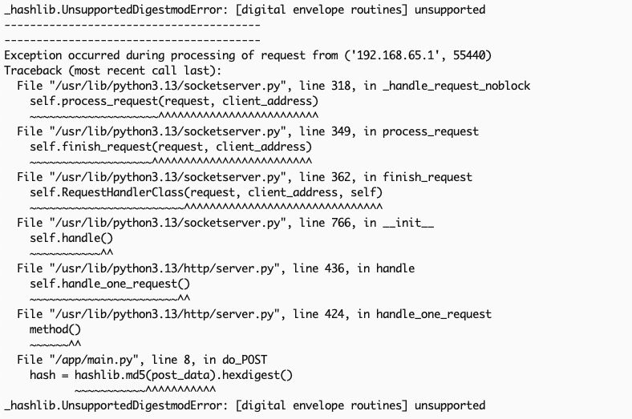

# Chainguard FIPS Demo

This demo illustrates how Chainguard delivers a kernel-independent FIPS implementation.  

That means you can run it on a non-FIPS-enabled kernel, such as your laptop, and still see how Chainguard enforces cryptographic compliance. 
Traditional FIPS workflows often depend on a specific kernel build or OS configuration. 
Chainguard removes that dependency so developers can build and test in any environment without waiting 
for specialized systems.  

---
## Demo Video
Watch [this video](https://chainguard.wistia.com/folders/e25isykiz0) to learn how to give a FIPS demo.

## What this demo shows

1. **Kernel independence**  
   Run FIPS-compliant cryptography even on machines without FIPS support baked into the kernel. This lowers the barrier to testing and developing 
   against FIPS requirements.  

2. **Built-in guardrails**  
   Chainguard’s FIPS-compliant images include protections that prevent you from using non-approved cryptography. The demo highlights how these safeguards 
   catch and block unsupported algorithms, ensuring compliance isn’t left up to chance.  

---

## Why it matters

- **For developers**: No more “works on my machine but not on FIPS-enabled kernel.” You can test locally and trust the results.  
- **For security teams**: Assurance that Chainguard’s FIPS images enforce compliance at runtime, not just at build time.  
- **For organizations**: Faster adoption of FIPS without the operational overhead of maintaining specialized environments.  

---

## How to run it

1. Clone this repo. 
2. Change the `FROM` line to use the Python FIPS image the prospect is interested in.  
2. Show `main.py` and discuss how this is a contrived example for demo purposes. It's a simple API that accepts a string and returns the hash of that string. 
Don't mention the cryptography in use. Save that for the ah-ha moment. If the prospect points out that md5 is not FIPS-compliant cryptography, you can go directly
into talking about the guardrails Chainguard includes to prevent you from inadvertently using unapproved cryptography. 
3. Show and describe the Dockerfile for context. This is a simple Dockerfile that copies a single Python script onto the image.
4. Build the image: `docker build -t python-fips-demo:latest .`
5. Run the image: `docker run -ti --rm -e PORT=8080 -p 8080:8080 python-fips-demo:latest`. Explain the command. We're running the image interactively so we can see stdout.
We're running the application on port `8080` and binding the container's port `8080` to the host's port `8080`.
and binding the host's port `8080` to the container port `8080`. 
6. Now, run a command to hit the endpoint: `curl -X POST -d "Hello World" http://localhost:8080`. You'll get an error:

7. Return to the terminal where the container is running and show the error logged on screen. Chainguard's FIPS-compliant Python image was able to detect that the application
is using non-FIPS-compliant cryptography.

8. Open `main.py` and change the cryptography used on line 8 from `md5` to `sha256`. Line 8 should appear as follows:
`        hash = hashlib.sha256(post_data).hexdigest()`
9. Build a new image: `docker build -t python-fips-demo-sha256:latest .`
10. Run the new image: `docker run -ti --rm -e PORT=8080 -p 8080:8080 python-fips-demo-sha256:latest`
11. Hit the endpoint: `curl -X POST -d "Hello World" http://localhost:8080`. Note that you now get a sha256 hash in return.
